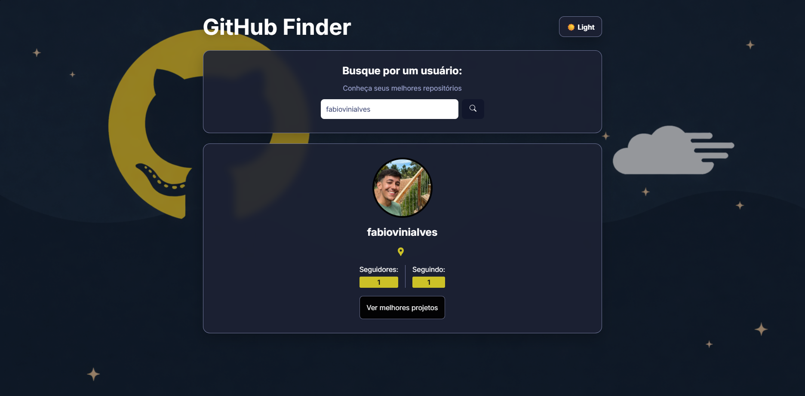

# GitHub Finder

  

  Aplicação web desenvolvida em <strong>React + TypeScript + Vite</strong> para buscar usuários do GitHub, visualizar informações do perfil e explorar seus repositórios em destaque.

  
  
  
  

## 📌 Sobre o projeto

O **GitHub Finder** é uma aplicação que consome a API pública do GitHub para buscar usuários e exibir seus dados principais de forma simples, visual e organizada.

Ao pesquisar um nome de usuário, a aplicação mostra:

- avatar do perfil
- login do usuário
- localização
- quantidade de seguidores
- quantidade de usuários seguidos
- acesso para visualizar os principais repositórios

Além disso, o projeto conta com **tema dark/light**, melhorando a experiência visual e permitindo alternar entre modos de exibição.

## ✨ Funcionalidades

- 🔎 Busca de usuários do GitHub
- 👤 Exibição das principais informações do perfil
- 📁 Listagem dos repositórios do usuário
- ⭐ Ordenação dos repositórios por número de estrelas
- 🧭 Navegação entre páginas com React Router
- ⏳ Indicador de carregamento durante as requisições
- ❌ Tratamento para usuário não encontrado
- 🌙☀️ Alternância entre tema escuro e claro
- 💾 Persistência do tema com `localStorage`

## 🖼️ Preview

### Tela inicial
Campo de busca para encontrar usuários e visualizar os dados principais do perfil.

### Tela de repositórios
Exibição dos repositórios mais relevantes do usuário, com linguagem principal, estrelas, forks e link direto para o código.

### Tema dark/light
A aplicação permite alternar entre tema claro e escuro, deixando a interface mais flexível e agradável.

## 🚀 Tecnologias utilizadas

- **React**
- **TypeScript**
- **Vite**
- **React Router DOM**
- **React Icons**
- **CSS Modules**
- **GitHub REST API**
- **localStorage**

## 🔍 Como usar
1. Digite o nome de um usuário do GitHub no campo de busca
2. Veja as informações principais do perfil encontrado
3. Clique em “Ver melhores projetos”
4. Explore os repositórios em destaque
5. Alterne entre tema dark/light pelo botão da interface

## 📚 Aprendizados

Este projeto foi importante para praticar:

- Consumo de API com fetch
- Tipagem com TypeScript
- Componentização no React
- Rotas com React Router
- Gerenciamento de estado com useState
- Efeitos colaterais com useEffect
- Estilização com CSS Modules
- Uso de variáveis CSS para temas
- Persistência de preferências com localStorage

